```mermaid
graph TD
    subgraph "CROSSAXISALIGNMENT - Row (Axe Vertical Y)"
        C_A[CrossAxisAlignment]

        %% START
        C_A --> START{"start : Alignés au Haut"}
        START --> START_VIS["Haut: 📦 📦 📦 <br/> | . . . . . . . . . . | <br/> | . . . . . . . . . . | <br/> | . . . . . . . . . . |"]

        %% END
        C_A --> END{"end : Alignés au Bas"}
        END --> END_VIS["| . . . . . . . . . . | <br/> | . . . . . . . . . . | <br/> | . . . . . . . . . . | <br/> Bas: 📦 📦 📦"]

        %% CENTER (Défaut)
        C_A --> CENTER{"center (Défaut) : Alignés au Centre Vertical"}
        CENTER --> CENTER_VIS["Haut: . . . . . . . . . . . <br/> | 📦 📦 📦 | <br/> Bas: . . . . . . . . . . ."]

        %% STRETCH
        C_A --> STRETCH{"stretch : Remplit la Hauteur Complète"}
        STRETCH --> STRETCH_VIS["Haut: 📦 📦 📦 <br/> | ┃ ┃ ┃ | <br/> | ┃ ┃ ┃ | <br/> Bas: 📦 📦 📦"]
        STRETCH_VIS -- "Les éléments s'étirent" --> STRETCH_NOTE("Remplit l'espace vertical disponible")
    end
```

# Module 3 : Construire des Interfaces (Layout)

---

## 🎯 Objectifs Généraux du Module

À la fin de ce module, vous serez capable de :

1. **Créer** des layouts horizontaux et verticaux avec Row et Column 
2. **Adapter** des interfaces proportionnelles avec Expanded et Flexible 
3. **Composer** des interfaces en profondeur avec Stack et Positioned
4. **Implémenter** des listes scrollables performantes avec ListView.builder 
5. **Concevoir** des grilles adaptatives avec GridView 
---


## Leçon 3.1 : Row et Column 

### 📚 Généralités

#### Introduction : Organiser l'Espace

En Flutter, **Row** et **Column** sont les briques fondamentales pour organiser vos widgets dans l'espace. Pensez-y comme à un système de coordonnées :

- **Row** = Axe **X** (horizontal) → Aligne les widgets de gauche à droite
- **Column** = Axe **Y** (vertical) → Aligne les widgets de haut en bas

**Analogie du monde réel** :
- **Row** = Livres alignés sur une étagère horizontale 📚➡️
- **Column** = Assiettes empilées verticalement 🍽️⬆️

---

#### Row : Organisation Horizontale

**Propriétés essentielles** :

| Propriété | Type | Description | Valeurs courantes |
|-----------|------|-------------|-------------------|
| `children` | List<Widget> | Widgets à aligner horizontalement | [Container(), Text(), ...] |
| `mainAxisAlignment` | MainAxisAlignment | Espacement sur axe principal (X) | center, spaceBetween, start, end |
| `crossAxisAlignment` | CrossAxisAlignment | Alignement sur axe secondaire (Y) | center, start, end, stretch |
| `mainAxisSize` | MainAxisSize | Taille totale de la Row | max (défaut), min |

---

#### 📊 Diagramme : MainAxisAlignment (Row)

```
═══════════════════════════════════════════════════════
      MAINAXISALIGNMENT - Row (axe horizontal X)
═══════════════════════════════════════════════════════

start (défaut) :
┌───────────────────────────────────────┐
│ 📦 📦 📦                              │
│ ↑ Début de la Row                     │
└───────────────────────────────────────┘

end :
┌───────────────────────────────────────┐
│                              📦 📦 📦 │
│                Fin de la Row ↑        │
└───────────────────────────────────────┘

center :
┌───────────────────────────────────────┐
│              📦 📦 📦                 │
│              ↑ Centrés ↑              │
└───────────────────────────────────────┘

spaceBetween :
┌───────────────────────────────────────┐
│ 📦        📦        📦               │
│ ↑ espace égal entre éléments          │
│   (PAS d'espace aux bords)            │
└───────────────────────────────────────┘

spaceAround :
┌───────────────────────────────────────┐
│   📦      📦      📦                  │
│ ↑ e ↑ 2e ↑ 2e ↑ e ↑                 │
│ (espace bords = e, entre = 2e)        │
└───────────────────────────────────────┘

spaceEvenly :
┌───────────────────────────────────────┐
│  📦     📦     📦                     │
│ ↑ e ↑ e ↑ e ↑ e ↑                    │
│ (TOUS les espaces égaux)              │
└───────────────────────────────────────┘
```

## MainAxisAlignment - Row (Axe Horizontal X)

```mermaid
graph TD
    subgraph "Row Alignment (Axe Principal X)"
        A[MainAxisAlignment]

        %% START (Défaut)
        A --> B{"start (Défaut)"}
        B --> B_VIS[["📦 | 📦 | 📦 | ------"]]
        B_VIS -- "Éléments au début" --> B_NOTE("Espace vide à la fin")

        %% END
        A --> C{"end"}
        C --> C_VIS[["------ | 📦 | 📦 | 📦"]]
        C_VIS -- "Éléments à la fin" --> C_NOTE("Espace vide au début")

        %% CENTER
        A --> D{"center"}
        D --> D_VIS[["-----| 📦 | 📦 | 📦 | -----"]]
        D_VIS -- "Éléments centrés" --> D_NOTE("Espace égal sur les deux bords")

        %% SPACE BETWEEN
        A --> E{"spaceBetween"}
        E --> E_VIS[["📦 | -----| 📦 | -----| 📦"]]
        E_VIS -- "Pas d'espace aux bords" --> E_NOTE("Espace maximal entre les éléments")

        %% SPACE AROUND
        A --> F{"spaceAround"}
        F --> F_VIS[["-| 📦 | -- | 📦 | -- | 📦 |-"]]
        F_VIS -- "Bords = e, Entre = 2e" --> F_NOTE("Espace avant et après chaque élément")

        %% SPACE EVENLY
        A --> G{"spaceEvenly"}
        G --> G_VIS[["- | 📦 | - | 📦 | - | 📦 | -"]]
        G_VIS -- "Tous les espaces égaux (e)" --> G_NOTE("Y compris l'espace des bords")
    end
```




---

#### 📊 Diagramme : CrossAxisAlignment (Row)

```
═══════════════════════════════════════════════════════
      CROSSAXISALIGNMENT - Row (axe vertical Y)
═══════════════════════════════════════════════════════

start :
┌───────────────┐
│ 📦  📦  📦   │ ← Haut de la Row
│              │
│              │
└───────────────┘

end :
┌───────────────┐
│              │
│              │
│ 📦  📦  📦   │ ← Bas de la Row
└───────────────┘

center (défaut) :
┌───────────────┐
│              │
│ 📦  📦  📦   │ ← Centre vertical
│              │
└───────────────┘

stretch :
┌───────────────┐
│ 📦  📦  📦   │ ↑
│ ┃   ┃   ┃   │ │ Remplit hauteur complète
│ 📦  📦  📦   │ ↓
└───────────────┘
```




---

#### Column : Organisation Verticale

**Propriétés essentielles** (identiques à Row, mais axes inversés) :

| Propriété | Description pour Column |
|-----------|------------------------|
| `mainAxisAlignment` | Espacement sur axe **vertical** (Y) |
| `crossAxisAlignment` | Alignement sur axe **horizontal** (X) |

**Règle simple** :
- Row : mainAxis = **horizontal**, crossAxis = **vertical**
- Column : mainAxis = **vertical**, crossAxis = **horizontal**

---


### 📝 Exemple A : Row Simple 

**Objectif** : Comprendre Row avec 2 Containers (exemple minimal)

```dart
import 'package:flutter/material.dart';

void main() => runApp(const MonApp());

class MonApp extends StatelessWidget {
  const MonApp({super.key});
  
  @override
  Widget build(BuildContext context) {
    return MaterialApp(
      home: Scaffold(
        appBar: AppBar(
          title: const Text('Row Simple'),
          backgroundColor: Colors.blue[600],
        ),
        body: Center(
          child: Row(
            // 1️⃣ Espacement HORIZONTAL (mainAxis)
            mainAxisAlignment: MainAxisAlignment.spaceEvenly,
            
            // 2️⃣ Alignement VERTICAL (crossAxis)
            crossAxisAlignment: CrossAxisAlignment.center,
            
            children: [
              // Container ROUGE
              Container(
                width: 100,
                height: 100,
                color: Colors.red,
                child: const Center(
                  child: Text(
                    'A',
                    style: TextStyle(
                      fontSize: 32,
                      color: Colors.white,
                      fontWeight: FontWeight.bold,
                    ),
                  ),
                ),
              ),
              
              // Container BLEU
              Container(
                width: 100,
                height: 100,
                color: Colors.blue,
                child: const Center(
                  child: Text(
                    'B',
                    style: TextStyle(
                      fontSize: 32,
                      color: Colors.white,
                      fontWeight: FontWeight.bold,
                    ),
                  ),
                ),
              ),
            ],
          ),
        ),
      ),
    );
  }
}
```


**Résultat visuel** :
```
┌────────────────────────┐
│     ┌───┐   ┌───┐     │
│     │ A │   │ B │     │
│     └───┘   └───┘     │
│   (espace égal)        │
└────────────────────────┘
```

---


### 📝 Exemple B : Column Simple 

**Objectif** : Comprendre Column avec 3 Text (progression)

```dart
import 'package:flutter/material.dart';

void main() => runApp(const MonApp());

class MonApp extends StatelessWidget {
  const MonApp({super.key});
  
  @override
  Widget build(BuildContext context) {
    return MaterialApp(
      home: Scaffold(
        appBar: AppBar(
          title: const Text('Column Simple'),
          backgroundColor: Colors.green[600],
        ),
        body: Center(
          child: Column(
            // 1️⃣ Espacement VERTICAL (mainAxis pour Column)
            mainAxisAlignment: MainAxisAlignment.center,
            
            // 2️⃣ Alignement HORIZONTAL (crossAxis pour Column)
            crossAxisAlignment: CrossAxisAlignment.start,
            
            children: [
              // Texte 1
              const Text(
                'Titre Principal',
                style: TextStyle(
                  fontSize: 24,
                  fontWeight: FontWeight.bold,
                ),
              ),
              
              const SizedBox(height: 8), // Espacement
              
              // Texte 2
              Text(
                'Sous-titre',
                style: TextStyle(
                  fontSize: 18,
                  color: Colors.grey[600],
                ),
              ),
              
              const SizedBox(height: 16),
              
              // Texte 3
              const Text(
                'Description détaillée du contenu.',
                style: TextStyle(fontSize: 14),
              ),
            ],
          ),
        ),
      ),
    );
  }
}
```

**Différence clé avec Row** :
- Column : mainAxis = **vertical** (haut → bas)
- Même logique, axes inversés !

**Résultat visuel** :
```
┌──────────────────────┐
│ Titre Principal      │ ← crossAxis: start (gauche)
│ Sous-titre           │
│ Description...       │
│                      │
└──────────────────────┘
```

---

### 📝 Exemple C : Row avec Tous les Alignements 

**Objectif** : Visualiser TOUS les mainAxisAlignment

```dart
import 'package:flutter/material.dart';

void main() => runApp(const MonApp());

class MonApp extends StatelessWidget {
  const MonApp({super.key});
  
  @override
  Widget build(BuildContext context) {
    return MaterialApp(
      home: Scaffold(
        appBar: AppBar(
          title: const Text('Alignements Row'),
        ),
        body: SingleChildScrollView(
          padding: const EdgeInsets.all(16.0),
          child: Column(
            children: [
              // ===== spaceBetween =====
              _buildExempleRow(
                'spaceBetween',
                MainAxisAlignment.spaceBetween,
              ),
              
              const SizedBox(height: 16),
              
              // ===== center =====
              _buildExempleRow(
                'center',
                MainAxisAlignment.center,
              ),
              
              const SizedBox(height: 16),
              
              // ===== spaceEvenly =====
              _buildExempleRow(
                'spaceEvenly',
                MainAxisAlignment.spaceEvenly,
              ),
              
              const SizedBox(height: 16),
              
              // ===== spaceAround =====
              _buildExempleRow(
                'spaceAround',
                MainAxisAlignment.spaceAround,
              ),
            ],
          ),
        ),
      ),
    );
  }
  
  // Méthode helper pour réduire duplication
  Widget _buildExempleRow(String titre, MainAxisAlignment alignment) {
    return Column(
      crossAxisAlignment: CrossAxisAlignment.start,
      children: [
        Text(
          titre,
          style: const TextStyle(
            fontSize: 16,
            fontWeight: FontWeight.bold,
          ),
        ),
        const SizedBox(height: 8),
        Container(
          height: 80,
          decoration: BoxDecoration(
            border: Border.all(color: Colors.grey),
            borderRadius: BorderRadius.circular(8),
          ),
          child: Row(
            mainAxisAlignment: alignment,
            children: [
              _buildBox(Colors.red, '1'),
              _buildBox(Colors.green, '2'),
              _buildBox(Colors.blue, '3'),
            ],
          ),
        ),
      ],
    );
  }
  
  Widget _buildBox(Color color, String label) {
    return Container(
      width: 60,
      height: 60,
      color: color,
      child: Center(
        child: Text(
          label,
          style: const TextStyle(
            color: Colors.white,
            fontSize: 20,
            fontWeight: FontWeight.bold,
          ),
        ),
      ),
    );
  }
}
```

**Exécutez ce code** pour voir visuellement les différences entre alignements !

---


### 📝 Exemple D : Row + Column Imbriquées 

**Objectif** : Combiner Row et Column (nesting)

```dart
import 'package:flutter/material.dart';

void main() => runApp(const MonApp());

class MonApp extends StatelessWidget {
  const MonApp({super.key});
  
  @override
  Widget build(BuildContext context) {
    return MaterialApp(
      home: Scaffold(
        appBar: AppBar(
          title: const Text('Row + Column'),
          backgroundColor: Colors.purple[600],
        ),
        body: Center(
          child: Card(
            margin: const EdgeInsets.all(16.0),
            elevation: 4.0,
            child: Padding(
              padding: const EdgeInsets.all(16.0),
              child: Row(
                mainAxisSize: MainAxisSize.min,
                children: [
                  // ===== GAUCHE : Icône circulaire =====
                  Container(
                    width: 60,
                    height: 60,
                    decoration: const BoxDecoration(
                      color: Colors.purple,
                      shape: BoxShape.circle,
                    ),
                    child: const Icon(
                      Icons.person,
                      color: Colors.white,
                      size: 32,
                    ),
                  ),
                  
                  const SizedBox(width: 16), // Espacement horizontal
                  
                  // ===== DROITE : Column avec infos =====
                  Column(
                    crossAxisAlignment: CrossAxisAlignment.start,
                    mainAxisSize: MainAxisSize.min,
                    children: [
                      const Text(
                        'Alice Dubois',
                        style: TextStyle(
                          fontSize: 18,
                          fontWeight: FontWeight.bold,
                        ),
                      ),
                      const SizedBox(height: 4),
                      Text(
                        'Développeuse Flutter',
                        style: TextStyle(
                          fontSize: 14,
                          color: Colors.grey[600],
                        ),
                      ),
                    ],
                  ),
                ],
              ),
            ),
          ),
        ),
      ),
    );
  }
}
```

**Structure hiérarchique** :
```
Scaffold
  └─ Center
      └─ Card
          └─ Padding
              └─ Row ← mainAxisSize.min (taille minimale)
                  ├─ Container (icône)
                  ├─ SizedBox (espacement)
                  └─ Column ← crossAxisAlignment.start
                      ├─ Text (nom)
                      ├─ SizedBox
                      └─ Text (poste)
```

---
### ✅ CHECKPOINT #1 
## Testez vos connaissances !

**Question** : Quelle propriété contrôle l'espacement HORIZONTAL dans une Row ?

**A)** crossAxisAlignment  
**B)** mainAxisAlignment   
**C)** mainAxisSize  
**D)** alignment
<br/>
<br/>
**Réponse: B**

**Justification** :
- **mainAxis** = axe PRINCIPAL (horizontal pour Row, vertical pour Column)
- **crossAxis** = axe PERPENDICULAIRE (vertical pour Row, horizontal pour Column)


---
### ✅ CHECKPOINT #2 

**Exercice de Prédiction** : Dessinez sur papier le résultat SANS exécuter le code :

```dart
Row(
  mainAxisAlignment: MainAxisAlignment.spaceBetween,
  children: [
    Container(width: 50, height: 50, color: Colors.red),
    Container(width: 50, height: 50, color: Colors.green),
    Container(width: 50, height: 50, color: Colors.blue),
  ],
)
```


Exécutez le code et comparez avec votre prédiction.


**Réponse attendue** :
```
spaceBetween crée des espaces ÉGAUX ENTRE les éléments,
mais PAS aux bords (début et fin).

[📦        📦        📦]
 ↑    espace égal    ↑
```

---

### 🎓 Série d'Exercices 

---

#### 📝 Exercice 1 : Lecture Annotée 


```dart
import 'package:flutter/material.dart';

void main() => runApp(const MonApp());

class MonApp extends StatelessWidget {
  const MonApp({super.key});
  
  @override
  Widget build(BuildContext context) {
    return MaterialApp(
      home: Scaffold(
        appBar: AppBar(title: const Text('Row Annotée')),
        body: Center(
          child: Row(
            // 1️⃣ MAINAXISALIGNMENT : Contrôle l'espacement HORIZONTAL
            // spaceBetween = espaces ÉGAUX entre les éléments
            mainAxisAlignment: MainAxisAlignment.spaceBetween,
            
            // 2️⃣ CROSSAXISALIGNMENT : Contrôle l'alignement VERTICAL
            // center = tous les enfants centrés verticalement
            crossAxisAlignment: CrossAxisAlignment.center,
            
            // 3️⃣ CHILDREN : Liste des widgets à organiser
            children: [
              // Container ROUGE à gauche
              Container(
                width: 80,
                height: 80,
                color: Colors.red,
                child: const Center(child: Text('A')),
              ),
              
              // Container VERT au centre (grâce à spaceBetween)
              Container(
                width: 80,
                height: 80,
                color: Colors.green,
                child: const Center(child: Text('B')),
              ),
              
              // Container BLEU à droite
              Container(
                width: 80,
                height: 80,
                color: Colors.blue,
                child: const Center(child: Text('C')),
              ),
            ],
          ),
        ),
      ),
    );
  }
}
```

**🔮 P - Predict** :  
Sans exécuter le code, dessinez sur papier le résultat attendu. Où seront les containers A, B, C ?

**▶️ R - Run** :  
Exécutez le code. Comparez avec votre prédiction.  

**🔍 I - Investigate** :  
1. Pourquoi les containers sont espacés ainsi ?  
2. Que signifie "spaceBetween" concrètement ?
3. Si la Row était plus large, que se passerait-il ?

**✏️ M - Modify** :  
Changez mainAxisAlignment de `spaceBetween` à :
1. `center` → Observez le changement
2. `start` → Observez le changement
3. `spaceEvenly` → Observez le changement

Quelle est la différence entre spaceBetween et spaceEvenly ?

**🛠️ M - Make** :  
Créez VOTRE Row avec :
- 4 Containers (couleurs au choix)
- mainAxisAlignment: MainAxisAlignment.spaceAround
- crossAxisAlignment: CrossAxisAlignment.start

---

#### 📝 Exercice 2 : Row 3 Containers 


```dart
import 'package:flutter/material.dart';

void main() => runApp(const MonApp());

class MonApp extends StatelessWidget {
  const MonApp({super.key});
  
  @override
  Widget build(BuildContext context) {
    return MaterialApp(
      home: Scaffold(
        appBar: AppBar(title: const Text('Mes 3 Containers')),
        body: Center(
          child: Padding(
            padding: const EdgeInsets.all(16.0),
            child: Row(
              mainAxisAlignment: MainAxisAlignment.spaceEvenly,
              children: [
                // 📦 CONTAINER 1
                Container(
                  width: 100,
                  height: 100,
                  decoration: BoxDecoration(
                    color: Colors.red[400],
                    borderRadius: BorderRadius.circular(12),
                  ),
                  child: const Center(
                    child: Text(
                      '1',
                      style: TextStyle(
                        fontSize: 32,
                        color: Colors.white,
                        fontWeight: FontWeight.bold,
                      ),
                    ),
                  ),
                ),
                
                // 📦 CONTAINER 2
                Container(
                  width: 100,
                  height: 100,
                  decoration: BoxDecoration(
                    color: Colors.green[400],
                    borderRadius: BorderRadius.circular(12),
                  ),
                  child: const Center(
                    child: Text(
                      '2',
                      style: TextStyle(
                        fontSize: 32,
                        color: Colors.white,
                        fontWeight: FontWeight.bold,
                      ),
                    ),
                  ),
                ),
                
                // 📦 CONTAINER 3
                Container(
                  width: 100,
                  height: 100,
                  decoration: BoxDecoration(
                    color: Colors.blue[400],
                    borderRadius: BorderRadius.circular(12),
                  ),
                  child: const Center(
                    child: Text(
                      '3',
                      style: TextStyle(
                        fontSize: 32,
                        color: Colors.white,
                        fontWeight: FontWeight.bold,
                      ),
                    ),
                  ),
                ),
              ],
            ),
          ),
        ),
      ),
    );
  }
}
```

**🔮 P - Predict** : Dessinez le résultat attendu

**▶️ R - Run** : Exécutez et comparez

**🔍 I - Investigate** :
1. Pourquoi `borderRadius` crée des coins arrondis ?
2. Que fait `BoxDecoration` ?
3. Quelle différence avec `color:` directement dans Container ?

**✏️ M - Modify** :
- Tâche 1 : Changez les couleurs (orange, violet, cyan)
- Tâche 2 : Changez borderRadius à 0 → Qu'observez-vous ?
- Tâche 3 : Changez mainAxisAlignment à spaceBetween

**🛠️ M - Make** :
Créez une Row avec 4 Containers :
- Couleurs : Rouge, Jaune, Vert, Bleu
- Tailles : 80×80 chacun
- Alignement : center
- Coins arrondis : 16

---

#### 📝 Exercice 3 : Column avec Textes 


```dart
import 'package:flutter/material.dart';

void main() => runApp(const MonApp());

class MonApp extends StatelessWidget {
  const MonApp({super.key});
  
  @override
  Widget build(BuildContext context) {
    return MaterialApp(
      home: Scaffold(
        appBar: AppBar(title: const Text('Ma Column')),
        body: Center(
          child: Column(
            // TODO 1 : Choisir un mainAxisAlignment
            // Options : start, center, end, spaceBetween, spaceAround, spaceEvenly
            mainAxisAlignment: MainAxisAlignment./* COMPLÉTEZ ICI */,
            
            // TODO 2 : Choisir un crossAxisAlignment
            // Options : start, center, end, stretch
            crossAxisAlignment: CrossAxisAlignment./* COMPLÉTEZ ICI */,
            
            children: [
              // TODO 3 : Créer un Text avec "Titre Principal"
              // Utilisez fontSize: 28, fontWeight: FontWeight.bold
              const Text(
                /* COMPLÉTEZ LE TEXTE */,
                style: TextStyle(
                  /* COMPLÉTEZ LE STYLE */
                ),
              ),
              
              const SizedBox(height: 16), // Espacement vertical
              
              // TODO 4 : Créer un Text avec "Sous-titre descriptif"
              // Utilisez fontSize: 18, color: Colors.grey[600]
              Text(
                /* COMPLÉTEZ */,
                style: TextStyle(
                  /* COMPLÉTEZ */
                ),
              ),
              
              const SizedBox(height: 24),
              
              // TODO 5 : Créer un ElevatedButton avec texte "Action"
              ElevatedButton(
                onPressed: () {
                  print('Bouton cliqué !');
                },
                child: const Text(/* COMPLÉTEZ */),
              ),
            ],
          ),
        ),
      ),
    );
  }
}
```

**💡 Indices fournis** :
- Indice 1 : Pour centrer verticalement, utilisez `mainAxisAlignment: MainAxisAlignment.center`
- Indice 2 : Pour aligner à gauche, utilisez `crossAxisAlignment: CrossAxisAlignment.start`
- Indice 3 : N'oubliez pas `const` pour les widgets immuables (performance !)

**🔮 P - Predict** : Avant de compléter, dessinez la structure attendue

**▶️ R - Run** : Complétez et exécutez

**🔍 I - Investigate** : Pourquoi utilise-t-on SizedBox pour l'espacement ?

**✏️ M - Modify** : Changez crossAxisAlignment à `center` puis `end`

**🛠️ M - Make** : Ajoutez un 4e élément (Icon) sous le bouton


---

#### 📝 Exercice 4 : Row + Column Imbriquées 

**Énoncé fonctionnel** :

Créez une interface "Carte de Contact" avec la structure suivante :

**Layout visuel** :
```
┌─────────────────────────────────┐
│  👤  │  Nom Prénom              │
│      │  Poste / Entreprise      │
│      │  ⭐⭐⭐⭐☆ (4/5)          │
└─────────────────────────────────┘
```

**Spécifications techniques** :

1. **Row principale** :
   - Avatar circulaire à gauche (80×80)
   - Column à droite avec informations
   - Espacement entre avatar et Column : 16px
   - mainAxisAlignment : start
   - crossAxisAlignment : center

2. **Column informations** :
   - Texte "Nom Prénom" (fontSize 20, bold)
   - Texte "Poste / Entreprise" (fontSize 14, grey)
   - Row avec 5 étoiles (4 pleines, 1 vide)
   - crossAxisAlignment : start

3. **Row étoiles** :
   - 5 Icon (Icons.star ou Icons.star_border)
   - mainAxisAlignment : start

**Widgets autorisés** :
- Row, Column
- Container (pour avatar circulaire → `shape: BoxShape.circle`)
- Text
- Icon (Icons.star, Icons.star_border)
- SizedBox (espacement)
- Card (optionnel pour embellir)

**💡 Indices** :
```
Indice 1 : Container avec decoration: BoxDecoration(shape: BoxShape.circle)
Indice 2 : Utilisez SizedBox(width: 16) entre avatar et Column
Indice 3 : Pour les étoiles, créez une Row avec 5 Icon
Indice 4 : Icons.star pour pleines, Icons.star_border pour vides
```


---

#### 📝 Exercice 5 : Interface Carte Profil 


**Cahier des charges** :

Créez une interface "Carte de Profil Utilisateur" selon les spécifications suivantes.

**Contraintes techniques obligatoires** :

1. **Structure globale** :
   - Card avec `elevation: 4.0`
   - Padding interne : `16.0` sur tous les côtés
   - BorderRadius : `12.0`
   - Largeur maximale : 350px

2. **Section 1 - En-tête** :
   - Row contenant :
     - Avatar circulaire (60×60, couleur: Colors.purple)
     - Nom utilisateur (fontSize: 20, bold)
     - IconButton paramètres (Icons.settings) aligné à droite
   - mainAxisAlignment : spaceBetween
   - crossAxisAlignment : center

3. **Section 2 - Séparateur** :
   - Divider avec `height: 32`

4. **Section 3 - Statistiques** :
   - Row avec 3 Column identiques
   - Chaque Column contient :
     - Nombre (fontSize: 24, bold)
     - Label (fontSize: 12, grey)
   - mainAxisAlignment : spaceEvenly

5. **Section 4 - Actions** :
   - Row avec 2 boutons
   - ElevatedButton "Voir Profil" et OutlinedButton "Message"
   - mainAxisAlignment : spaceEvenly
   - Espacement entre boutons : 8px

**Données à afficher** :
- Nom : "Alice Dubois"
- Projets : 24
- Followers : 1.2k
- Likes : 856


---

### 🔄 Wrap-up

**Ce que vous savez maintenant** :
- ✅ Organiser des widgets horizontalement (Row) et verticalement (Column)
- ✅ Contrôler les alignements avec mainAxisAlignment et crossAxisAlignment
- ✅ Imbriquer Row et Column pour créer des layouts complexes

**Le problème non résolu** :

Vous avez peut-être remarqué quelque chose : comment **répartir l'espace disponible de manière proportionnelle** ?

Par exemple, imaginez que vous voulez créer une interface où :
- La sidebar prend **30%** de l'espace
- Le contenu principal prend **70%** de l'espace

Avec Row et Column seuls, c'est **impossible** ! Les widgets prennent leur taille naturelle (width/height fixe).

**La solution** : **Expanded** et **Flexible** ! 🎯

Ces widgets vont transformer vos layouts rigides en interfaces adaptatives et proportionnelles. Rendez-vous dans la Leçon 3.2 pour découvrir cette magie !

---


## Leçon 3.2 : Expanded et Flexible - Layouts Proportionnels


---

### 📚 Rappel : Le Problème à Résoudre

Dans la Leçon 3.1, nous avons créé des Row et Column avec des tailles **fixes** :

```dart
Row(
  children: [
    Container(width: 100, ...), // Taille FIXE
    Container(width: 150, ...), // Taille FIXE
  ],
)
```

**Problèmes** :
1. ❌ Sur petit écran → **Overflow** (débordement)
2. ❌ Sur grand écran → Espace vide inutilisé
3. ❌ Impossible de dire "30% / 70%" proportionnellement

**Solution** : **Expanded** et **Flexible** ! 🎯

---

### 📚 Généralités

#### Expanded : Forcer l'Occupation de l'Espace

**Expanded** dit à un widget : "**PRENDS tout l'espace disponible**" (force).

```dart
Row(
  children: [
    Expanded(
      child: Container(color: Colors.red),
    ),
    Expanded(
      child: Container(color: Colors.blue),
    ),
  ],
)
```

**Résultat** : Rouge et Bleu se **partagent** l'espace **50/50**.

---

#### 📊 Diagramme : Expanded vs Containers Fixes

```
═══════════════════════════════════════════════════════
         SANS Expanded (tailles fixes)
═══════════════════════════════════════════════════════

Row(
  children: [
    Container(width: 100, ...),
    Container(width: 100, ...),
  ],
)

┌───────────────────────────────────────┐
│ 📦📦                                 │
│ 100 100 ← Espace vide inutilisé       │
└───────────────────────────────────────┘

═══════════════════════════════════════════════════════
         AVEC Expanded (remplit l'espace)
═══════════════════════════════════════════════════════

Row(
  children: [
    Expanded(child: Container(...)),
    Expanded(child: Container(...)),
  ],
)

┌───────────────────────────────────────┐
│ 📦📦📦📦📦📦│📦📦📦📦📦📦       │
│ ← 50%         →│← 50%  → Tout rempli  │
└───────────────────────────────────────┘
```

---

#### Flex Ratio : Contrôler les Proportions

La propriété `flex` contrôle **combien d'espace** prend chaque Expanded :

```dart
Row(
  children: [
    Expanded(flex: 1, child: Container(color: Colors.red)),
    Expanded(flex: 2, child: Container(color: Colors.blue)),
    Expanded(flex: 1, child: Container(color: Colors.green)),
  ],
)
```

**Calcul des proportions** :
- Total flex = 1 + 2 + 1 = **4**
- Rouge : 1/4 = **25%**
- Bleu : 2/4 = **50%**
- Vert : 1/4 = **25%**

**Formule** :
```
Proportion = flex individuel / somme totale des flex
```

---

#### 📊 Diagramme : Flex Ratios Visuels

```
═══════════════════════════════════════════════════════
         FLEX RATIOS (1 : 2 : 1)
═══════════════════════════════════════════════════════

Expanded(flex: 1)  Expanded(flex: 2)  Expanded(flex: 1)

┌───────────────────────────────────────┐
│ 📦📦│📦📦📦📦│📦📦                │
│ 25%  │    50%   │ 25%                 │
└───────────────────────────────────────┘

Autres exemples :

flex: 1, 1, 1 (égal) :
┌───────────────────────────────────────┐
│ 📦📦📦│📦📦📦│📦📦📦             │
│   33%  │   33%  │  33%                │
└───────────────────────────────────────┘

flex: 3, 1 (3× plus grand) :
┌───────────────────────────────────────┐
│ 📦📦📦📦📦📦📦📦📦│📦📦📦       │
│       75%             │  25%          │
└───────────────────────────────────────┘
```


---

### 📝 Exemple Simple : Expanded avec Flex Ratios

```dart
import 'package:flutter/material.dart';

void main() => runApp(const MonApp());

class MonApp extends StatelessWidget {
  const MonApp({super.key});
  
  @override
  Widget build(BuildContext context) {
    return MaterialApp(
      home: Scaffold(
        appBar: AppBar(title: const Text('Expanded Flex')),
        body: Column(
          children: [
            // ===== Exemple 1 : flex 1-2-1 =====
            Container(
              height: 100,
              child: Row(
                children: [
                  Expanded(
                    flex: 1,
                    child: Container(
                      color: Colors.red,
                      child: const Center(
                        child: Text('25%', style: TextStyle(color: Colors.white)),
                      ),
                    ),
                  ),
                  Expanded(
                    flex: 2,
                    child: Container(
                      color: Colors.blue,
                      child: const Center(
                        child: Text('50%', style: TextStyle(color: Colors.white)),
                      ),
                    ),
                  ),
                  Expanded(
                    flex: 1,
                    child: Container(
                      color: Colors.green,
                      child: const Center(
                        child: Text('25%', style: TextStyle(color: Colors.white)),
                      ),
                    ),
                  ),
                ],
              ),
            ),
            
            const SizedBox(height: 16),
            
            // ===== Exemple 2 : flex 3-1 =====
            Container(
              height: 100,
              child: Row(
                children: [
                  Expanded(
                    flex: 3,
                    child: Container(
                      color: Colors.orange,
                      child: const Center(
                        child: Text('75%', style: TextStyle(color: Colors.white)),
                      ),
                    ),
                  ),
                  Expanded(
                    flex: 1,
                    child: Container(
                      color: Colors.purple,
                      child: const Center(
                        child: Text('25%', style: TextStyle(color: Colors.white)),
                      ),
                    ),
                  ),
                ],
              ),
            ),
          ],
        ),
      ),
    );
  }
}
```

---

### ✅ CHECKPOINT #1 

**Question** : Si une Row contient 3 Expanded :
- Expanded(flex: 2)
- Expanded(flex: 3)
- Expanded(flex: 1)

Quelle proportion d'espace chaque Expanded occupera-t-il ?

**A)** 33%, 33%, 33%  
**B)** 33%, 50%, 17% 
**C)** 20%, 30%, 10%  
**D)** 2/6, 3/6, 1/6 
<br>
<br>

**Réponses: B et D**

**Calcul détaillé** :
```
Total flex = 2 + 3 + 1 = 6

Premier : 2/6 = 0.333... = 33.3%
Deuxième : 3/6 = 0.5 = 50%
Troisième : 1/6 = 0.166... = 16.7%
```

**Règle à retenir** :
```
Proportion = (flex individuel) / (somme de tous les flex)
```

---

### 📚 Flexible : Permission d'Occupation (vs Force)

**Différence clé** entre Expanded et Flexible :

| Aspect | Expanded | Flexible |
|--------|----------|----------|
| Comportement | **FORCE** à prendre tout l'espace | **PERMET** de prendre l'espace |
| FlexFit | `FlexFit.tight` (serré) | `FlexFit.loose` (lâche) par défaut |
| Taille widget | Toujours maximale | Peut être plus petite que l'espace alloué |
| Usage | Remplir l'espace disponible | S'adapter au contenu |

**Exemple concret** :

```dart
// Avec EXPANDED (force) :
Row(
  children: [
    Expanded(
      child: Text('Court'), // Forcé à prendre 50%
    ),
    Expanded(
      child: Text('Très long texte qui déborde'), // Forcé à prendre 50%
    ),
  ],
)
```

```dart
// Avec FLEXIBLE (permission) :
Row(
  children: [
    Flexible(
      child: Text('Court'), // Prend seulement ce dont il a besoin
    ),
    Flexible(
      child: Text('Très long texte'), // Peut rétrécir si nécessaire
    ),
  ],
)
```

---

#### 📊 Diagramme : Expanded vs Flexible

```
═══════════════════════════════════════════════════════
         EXPANDED (FlexFit.tight - FORCE)
═══════════════════════════════════════════════════════

Row avec 2 Expanded, texte court :

┌───────────────────────────────────────┐
│ Court        │ Autre texte            │
│ ← forcé      │ ← forcé à remplir 50%  │
│ 50%          │ 50%                    │
└───────────────────────────────────────┘

═══════════════════════════════════════════════════════
         FLEXIBLE (FlexFit.loose - PERMISSION)
═══════════════════════════════════════════════════════

Row avec 2 Flexible, texte court :

┌───────────────────────────────────────┐
│ Court │ Autre texte                   │
│ ← taille naturelle                    │
└───────────────────────────────────────┘

Le widget ne prend que l'espace nécessaire (plus petit OK).
```

**Règle de décision** :
- Contenu doit **remplir** l'espace → **Expanded**
- Contenu peut être **plus petit** → **Flexible**

---

### 📝 Exemple Comparatif : Expanded vs Flexible

```dart
import 'package:flutter/material.dart';

void main() => runApp(const MonApp());

class MonApp extends StatelessWidget {
  const MonApp({super.key});
  
  @override
  Widget build(BuildContext context) {
    return MaterialApp(
      home: Scaffold(
        appBar: AppBar(title: const Text('Expanded vs Flexible')),
        body: Padding(
          padding: const EdgeInsets.all(16.0),
          child: Column(
            crossAxisAlignment: CrossAxisAlignment.start,
            children: [
              // ===== Titre Exemple 1 =====
              const Text(
                'Avec EXPANDED (force) :',
                style: TextStyle(fontWeight: FontWeight.bold),
              ),
              const SizedBox(height: 8),
              
              // ===== Row avec Expanded =====
              Container(
                height: 60,
                decoration: BoxDecoration(
                  border: Border.all(color: Colors.grey),
                ),
                child: Row(
                  children: [
                    Expanded(
                      child: Container(
                        color: Colors.red[200],
                        child: const Center(child: Text('Court')),
                      ),
                    ),
                    Expanded(
                      child: Container(
                        color: Colors.blue[200],
                        child: const Center(child: Text('Autre')),
                      ),
                    ),
                  ],
                ),
              ),
              
              const SizedBox(height: 24),
              
              // ===== Titre Exemple 2 =====
              const Text(
                'Avec FLEXIBLE (permission) :',
                style: TextStyle(fontWeight: FontWeight.bold),
              ),
              const SizedBox(height: 8),
              
              // ===== Row avec Flexible =====
              Container(
                height: 60,
                decoration: BoxDecoration(
                  border: Border.all(color: Colors.grey),
                ),
                child: Row(
                  children: [
                    Flexible(
                      child: Container(
                        color: Colors.red[200],
                        padding: const EdgeInsets.all(8),
                        child: const Text('Court'),
                      ),
                    ),
                    const SizedBox(width: 8),
                    Flexible(
                      child: Container(
                        color: Colors.blue[200],
                        padding: const EdgeInsets.all(8),
                        child: const Text('Autre'),
                      ),
                    ),
                  ],
                ),
              ),
              
              const SizedBox(height: 16),
              
              // ===== Explication =====
              Container(
                padding: const EdgeInsets.all(12),
                decoration: BoxDecoration(
                  color: Colors.yellow[100],
                  borderRadius: BorderRadius.circular(8),
                ),
                child: const Text(
                  '💡 Notez la différence :\n'
                  '• Expanded remplit TOUT l\'espace (50/50)\n'
                  '• Flexible prend seulement ce dont il a besoin',
                  style: TextStyle(fontSize: 12),
                ),
              ),
            ],
          ),
        ),
      ),
    );
  }
}
```

**Exécutez ce code** pour voir visuellement la différence !

---

### ✅ CHECKPOINT #2 

**Question** : Quand utiliser **Flexible** plutôt qu'**Expanded** ?

**A)** Toujours, Flexible est meilleur dans tous les cas  
**B)** Quand le widget peut être plus petit que l'espace alloué ✓  
**C)** Jamais, Expanded suffit toujours  
**D)** Seulement pour les images

<br>
<br>

**Réponse: B**

**Explication** :
- **Expanded** : FORCE le widget à prendre TOUT l'espace (FlexFit.tight)
- **Flexible** : PERMET au widget de prendre l'espace mais pas forcé (FlexFit.loose)

**Cas d'usage Flexible** :
1. Texte de longueur variable
2. Bouton avec largeur naturelle
3. Image qui ne doit pas être étirée
4. Widget qui peut "rétrécir" si nécessaire

**Cas d'usage Expanded** :
1. Colonnes de données (tableau)
2. Sections d'interface (30/70)
3. Remplissage systématique
4. Éviter espace vide

---

### 🎓 Série d'Exercices

---

#### 📝 Exercice 1 : Expanded Ratio 1:2:1 


**Code fourni** :

```dart
import 'package:flutter/material.dart';

void main() => runApp(const MonApp());

class MonApp extends StatelessWidget {
  const MonApp({super.key});
  
  @override
  Widget build(BuildContext context) {
    return MaterialApp(
      home: Scaffold(
        appBar: AppBar(title: const Text('Expanded 1:2:1')),
        body: Padding(
          padding: const EdgeInsets.all(16.0),
          child: Row(
            children: [
              // ===== SECTION 1 : flex = 1 =====
              Expanded(
                flex: 1, // Prend 1 part sur 4 total (25%)
                child: Container(
                  height: 150,
                  color: Colors.red[300],
                  child: const Center(
                    child: Text(
                      '25%',
                      style: TextStyle(
                        fontSize: 24,
                        color: Colors.white,
                        fontWeight: FontWeight.bold,
                      ),
                    ),
                  ),
                ),
              ),
              
              const SizedBox(width: 8), // Espacement
              
              // ===== SECTION 2 : flex = 2 =====
              Expanded(
                flex: 2, // Prend 2 parts sur 4 total (50%)
                child: Container(
                  height: 150,
                  color: Colors.blue[300],
                  child: const Center(
                    child: Text(
                      '50%',
                      style: TextStyle(
                        fontSize: 24,
                        color: Colors.white,
                        fontWeight: FontWeight.bold,
                      ),
                    ),
                  ),
                ),
              ),
              
              const SizedBox(width: 8),
              
              // ===== SECTION 3 : flex = 1 =====
              Expanded(
                flex: 1, // Prend 1 part sur 4 total (25%)
                child: Container(
                  height: 150,
                  color: Colors.green[300],
                  child: const Center(
                    child: Text(
                      '25%',
                      style: TextStyle(
                        fontSize: 24,
                        color: Colors.white,
                        fontWeight: FontWeight.bold,
                      ),
                    ),
                  ),
                ),
              ),
            ],
          ),
        ),
      ),
    );
  }
}
```

**🔮 P - Predict** : Avant d'exécuter, dessinez les 3 sections avec leurs proportions

**▶️ R - Run** : Exécutez et comparez

**🔍 I - Investigate** :
1. Pourquoi le container bleu est-il 2× plus large ?
2. Que se passe si vous changez flex: 2 en flex: 4 ?
3. Total flex = 1+2+1 = 4. Vérifiez les proportions.

**✏️ M - Modify** :
- Changez les flex en 2, 3, 2 → Calculez les nouvelles proportions
- Changez les flex en 1, 1, 1 → Qu'observez-vous ?

**🛠️ M - Make** :
Créez une Row avec 4 Expanded : flex 1, 2, 2, 1 (total = 6)

---

#### 📝 Exercice 2 : Flexible vs Expanded 


**Structure fournie** :

```dart
import 'package:flutter/material.dart';

void main() => runApp(const MonApp());

class MonApp extends StatelessWidget {
  const MonApp({super.key});
  
  @override
  Widget build(BuildContext context) {
    return MaterialApp(
      home: Scaffold(
        appBar: AppBar(title: const Text('Flexible vs Expanded')),
        body: Padding(
          padding: const EdgeInsets.all(16.0),
          child: Column(
            crossAxisAlignment: CrossAxisAlignment.start,
            children: [
              const Text('Exemple 1 : Expanded', style: TextStyle(fontWeight: FontWeight.bold)),
              const SizedBox(height: 8),
              
              // TODO 1 : Créez une Row avec 2 Expanded
              // Container 1 : Rouge, texte "Court"
              // Container 2 : Bleu, texte "Texte"
              // Les 2 doivent avoir flex: 1 (50/50)
              Container(
                height: 60,
                decoration: BoxDecoration(border: Border.all()),
                child: Row(
                  children: [
                    // TODO : Complétez ici
                  ],
                ),
              ),
              
              const SizedBox(height: 24),
              
              const Text('Exemple 2 : Flexible', style: TextStyle(fontWeight: FontWeight.bold)),
              const SizedBox(height: 8),
              
              // TODO 2 : Créez une Row avec 2 Flexible
              // Même contenu, mais avec Flexible au lieu d'Expanded
              Container(
                height: 60,
                decoration: BoxDecoration(border: Border.all()),
                child: Row(
                  children: [
                    // TODO : Complétez ici
                  ],
                ),
              ),
              
              const SizedBox(height: 16),
              
              // ===== Question à répondre =====
              Container(
                padding: const EdgeInsets.all(12),
                decoration: BoxDecoration(
                  color: Colors.yellow[100],
                  borderRadius: BorderRadius.circular(8),
                ),
                child: const Text(
                  '❓ Quelle est la différence visuelle entre les 2 exemples ?',
                  style: TextStyle(fontSize: 14),
                ),
              ),
            ],
          ),
        ),
      ),
    );
  }
}
```

**💡 Indices** :
- Utilisez `Container` avec `color:` pour les sections colorées
- Pour Flexible, ajoutez `padding: EdgeInsets.all(8)` pour voir la différence
- Utilisez `Center(child: Text(...))` pour centrer le texte

**🔮 P - Predict** : Avant de coder, dessinez comment seront les 2 Rows

**▶️ R - Run** : Complétez et exécutez

**🔍 I - Investigate** : Mesurez visuellement : les sections ont-elles la même largeur ?

**✏️ M - Modify** : Dans l'exemple Flexible, changez "Court" en "Texte très long"


---

#### 📝 Exercice 3 : Interface Sidebar 30/70 (Palier 3) - 15 min


**Énoncé** :

Créez une interface avec **sidebar** (barre latérale) et **contenu principal** :

**Layout visuel** :
```
┌────────────────────────────────┐
│ 📋     │ 📄                   │
│ Menu   │ Contenu Principal    │
│        │                       │
│ • Item │ Texte du contenu...  │
│ • Item │                       │
│ • Item │                       │
│        │                       │
│        │                       │
└────────────────────────────────┘
 ← 30%  →← 70%                 →
```

**Spécifications** :

1. **Structure** :
   - Row principale avec 2 Expanded
   - Sidebar : flex = 3 (30%)
   - Contenu : flex = 7 (70%)

2. **Sidebar (gauche)** :
   - Couleur de fond : Colors.blue[800]
   - Padding : 16px tous côtés
   - Column avec :
     - Titre "Menu" (blanc, fontSize 20, bold)
     - SizedBox(height: 24)
     - 4 ListTile avec Icons et texte

3. **Contenu (droite)** :
   - Couleur de fond : Colors.grey[100]
   - Padding : 24px
   - Column avec :
     - Titre "Contenu Principal" (fontSize 24, bold)
     - SizedBox(height: 16)
     - Texte descriptif (5-6 lignes de Lorem Ipsum)

**Widgets recommandés** :
- Row, Column, Expanded
- Container (pour couleurs de fond)
- ListTile (pour items menu)
- Text

**💡 Indices** :
```
Indice 1 : flex: 3 et flex: 7 donnent ratio 30/70 (3/(3+7) = 30%)
Indice 2 : ListTile(leading: Icon(...), title: Text(...))
Indice 3 : Pour hauteur pleine écran, wrappez Row dans SizedBox(height: MediaQuery.of(context).size.height)
```

---

### ✅ CHECKPOINT #3 

**Problème** : Le code suivant génère un **OVERFLOW** ⚠️

```dart
Row(
  children: [
    Container(width: 200, height: 100, color: Colors.red),
    Container(width: 200, height: 100, color: Colors.blue),
    Container(width: 200, height: 100, color: Colors.green),
  ],
)
```

Sur un écran de 500px de large : 200 + 200 + 200 = **600 > 500** → OVERFLOW !

**Tâche** : Corrigez en utilisant **Expanded** pour répartir l'espace proportionnellement.


**Solution** :
```dart
Row(
  children: [
    Expanded(child: Container(height: 100, color: Colors.red)),
    Expanded(child: Container(height: 100, color: Colors.blue)),
    Expanded(child: Container(height: 100, color: Colors.green)),
  ],
)
```

**Explication** :
- Chaque Expanded prend 1/3 de l'espace disponible
- Plus besoin de `width:` fixe
- S'adapte automatiquement à la taille de l'écran


---

### 🔄 Wrap-up
**Ce que vous savez maintenant** :
- ✅ Répartir l'espace proportionnellement avec Expanded (flex ratios)
- ✅ Différencier Expanded (force) vs Flexible (permission)
- ✅ Résoudre les overflows avec des layouts adaptatifs

**Le nouveau défi** :

Jusqu'ici, nous avons travaillé en **2 dimensions** :
- X (horizontal) avec Row
- Y (vertical) avec Column

Mais comment ajouter de la **profondeur** ? Comment **superposer** des widgets les uns sur les autres ?

Par exemple, imaginez :
- Un badge "NEW" sur une image de produit
- Un bouton flottant sur une carte
- Un overlay semi-transparent sur une photo

C'est impossible avec Row/Column seuls ! Il nous faut la **3e dimension : Z** (profondeur).

**La solution** : **Stack** et **Positioned** ! 🎯

Ces widgets vont vous permettre de créer des interfaces avec plusieurs "couches" superposées. Rendez-vous dans la Leçon 3.3 pour maîtriser la dimension Z !


---

## Leçon 3.3 : Stack et Positioned - La Profondeur (Z)


### 🎯 Objectifs d'Apprentissage SMART

À la fin de cette leçon, vous serez capable de :

1. **Expliquer** (Bloom 2) : Le concept de z-index avec schéma 
2. **Positionner** (Bloom 3) : Un widget avec Positioned(top, left, right, bottom) 
3. **Créer** (Bloom 3) : Un overlay semi-transparent sur une image 
4. **Analyser** (Bloom 4) : L'ordre d'empilement dans un Stack existant
5. **Composer** (Bloom 6) : Une carte avec badges superposés 

---

### 📚 Rappel : Le Problème à Résoudre

Row et Column organisent les widgets dans un **plan 2D** (X, Y) :

```
Y (vertical)
↑
│  📦  📦  📦  ← Row (axe X)
│
└────────────→ X (horizontal)
```

Mais comment **superposer** des widgets (comme des calques Photoshop) ?

**Cas d'usage réels** :
- Badge "NEW" sur image produit
- Bouton favoris sur photo
- Overlay sombre sur vidéo
- Prix sur image immobilière

**Solution** : **Stack** + **Positioned** pour la dimension **Z** (profondeur) !

---

### 📚 Contenu Théorique

#### Stack : La Superposition

**Stack** empile des widgets les uns **sur** les autres (comme une pile d'assiettes).

```dart
Stack(
  children: [
    Container(color: Colors.red, width: 200, height: 200),   // Arrière-plan
    Container(color: Colors.blue, width: 150, height: 150),  // Milieu
    Container(color: Colors.green, width: 100, height: 100), // Devant
  ],
)
```

**Règle d'or** : Le **DERNIER** widget dans `children` est **DEVANT** (dessus).

---

#### 📊 Diagramme : Z-Index Explicite

```
═══════════════════════════════════════════════════════
            Z-INDEX dans Stack
═══════════════════════════════════════════════════════

Vue de PROFIL (axe Z ↑) :

Stack(
  children: [
    Container 1,  ← z=0 (arrière-plan)
    Container 2,  ← z=1 (milieu)
    Container 3,  ← z=2 (avant-plan)
  ],
)

         z=2 (DESSUS) ┐
       ┌──────────────┤
       │ Container 3  │
       ├──────────────┤ z=1 (milieu)
       │ Container 2  │
       ├──────────────┤ z=0 (DESSOUS)
       │ Container 1  │
       └──────────────┘

Vue de FACE (ce que l'utilisateur voit) :

┌──────────────────┐
│     ┌──3──┐      │ ← Container 3 (vert, dessus)
│     │  ┌──2──┐   │ ← Container 2 (bleu, milieu)
│  ┌──1──┼──┐  │   │ ← Container 1 (rouge, dessous)
│  │  │  └──┘  │   │
│  │  └────────┘   │
│  └───────────────┘
└──────────────────┘

💡 Règle : DERNIER dans la liste = DESSUS visuellement
```

---


### 📝 Exemple Simple : Stack 3 Couches

```dart
import 'package:flutter/material.dart';

void main() => runApp(const MonApp());

class MonApp extends StatelessWidget {
  const MonApp({super.key});
  
  @override
  Widget build(BuildContext context) {
    return MaterialApp(
      home: Scaffold(
        appBar: AppBar(title: const Text('Stack Simple')),
        body: Center(
          child: Stack(
            alignment: Alignment.center, // Centre tous les enfants
            children: [
              // ===== COUCHE 1 : Arrière-plan (200×200) =====
              Container(
                width: 200,
                height: 200,
                color: Colors.red[300],
                child: const Center(
                  child: Text(
                    'Arrière',
                    style: TextStyle(color: Colors.white, fontSize: 18),
                  ),
                ),
              ),
              
              // ===== COUCHE 2 : Milieu (150×150) =====
              Container(
                width: 150,
                height: 150,
                color: Colors.blue[300],
                child: const Center(
                  child: Text(
                    'Milieu',
                    style: TextStyle(color: Colors.white, fontSize: 18),
                  ),
                ),
              ),
              
              // ===== COUCHE 3 : Devant (100×100) =====
              Container(
                width: 100,
                height: 100,
                color: Colors.green[300],
                child: const Center(
                  child: Text(
                    'Devant',
                    style: TextStyle(color: Colors.white, fontSize: 16),
                  ),
                ),
              ),
            ],
          ),
        ),
      ),
    );
  }
}
```

**Résultat visuel** :
```
┌──────────────────┐
│  ┌────────────┐  │ ← Rouge (200×200, arrière)
│  │ ┌────────┐ │  │ ← Bleu (150×150, milieu)
│  │ │ ┌────┐ │ │  │ ← Vert (100×100, devant)
│  │ │ │Dvt │ │ │  │
│  │ │ └────┘ │ │  │
│  │ └────────┘ │  │
│  └────────────┘  │
└──────────────────┘
```

---

### ✅ CHECKPOINT #1

**Question** : Quel widget sera visible DEVANT (dessus) ?

```dart
Stack(
  children: [
    Container(color: Colors.red, width: 100, height: 100),
    Container(color: Colors.blue, width: 80, height: 80),
    Container(color: Colors.green, width: 60, height: 60),
  ],
)
```

**A)** Rouge (premier dans liste)  
**B)** Bleu (au milieu)  
**C)** Vert (dernier dans liste) 
**D)** Aucun, ils sont côte à côte

<br>
<br>

**Réponse C**

**Justification** :
- Dans un Stack, l'ordre = z-index
- **Premier** dans children[] = **DESSOUS** (arrière-plan)
- **Dernier** dans children[] = **DESSUS** (avant-plan)

**Résultat visuel** :
```
Vue profil :   Vue face :
┌─ Vert (z=2)   ┌────┐
├─ Bleu (z=1)   │Vert│
└─ Rouge (z=0)  │Bleu│
                │Rouge
```

**Règle** : **children[0] = arrière**, **children[last] = devant**

---

### 📚 Positioned : Positionner Précisément

**Positioned** permet de placer un widget à une position **exacte** dans le Stack.

**Propriétés** (coordonnées en pixels) :

| Propriété | Description | Origine |
|-----------|-------------|---------|
| `top` | Distance depuis le **haut** | 0 = en haut |
| `bottom` | Distance depuis le **bas** | 0 = en bas |
| `left` | Distance depuis la **gauche** | 0 = à gauche |
| `right` | Distance depuis la **droite** | 0 = à droite |

**Exemple** :
```dart
Stack(
  children: [
    Container(color: Colors.grey, width: 200, height: 200),
    Positioned(
      top: 10,
      right: 10,
      child: Container(color: Colors.red, width: 40, height: 40),
    ),
  ],
)
```

**Résultat** : Carré rouge dans le **coin supérieur droit**.

---

#### 📊 Diagramme : Positioned Coordonnées

```
═══════════════════════════════════════════════════════
         POSITIONED - Système de Coordonnées
═══════════════════════════════════════════════════════

Stack (parent 200×200) :

top: 0
┌──────────────────────────────┐ ← Haut
│                              │
│  Positioned(                 │
│    top: 10,    ← 10px du haut│
│    right: 10,  ← 10px droite │
│    child: 📦  ───────────────┤ right: 0
│  )                           │
│                              │
│                              │
└──────────────────────────────┘ ← bottom: 0
↑                              ↑
left: 0                   right: 0

Exemples de positionnement :

Positioned(top: 10, left: 10)    → Coin supérieur GAUCHE
Positioned(top: 10, right: 10)   → Coin supérieur DROIT
Positioned(bottom: 10, left: 10) → Coin inférieur GAUCHE
Positioned(bottom: 10, right: 10)→ Coin inférieur DROIT

Positioned(
  top: 0,
  left: 0,
  right: 0,
  bottom: 0,
) → Remplit TOUT le Stack (équivalent à ne pas utiliser Positioned)
```

---

### 📝 Exemple : Badge Positionné

```dart
import 'package:flutter/material.dart';

void main() => runApp(const MonApp());

class MonApp extends StatelessWidget {
  const MonApp({super.key});
  
  @override
  Widget build(BuildContext context) {
    return MaterialApp(
      home: Scaffold(
        appBar: AppBar(title: const Text('Badge Positionné')),
        backgroundColor: Colors.grey[200],
        body: Center(
          child: SizedBox(
            width: 200,
            height: 200,
            child: Stack(
              children: [
                // ===== IMAGE DE FOND =====
                Container(
                  decoration: BoxDecoration(
                    color: Colors.blue[300],
                    borderRadius: BorderRadius.circular(12),
                  ),
                  child: const Center(
                    child: Icon(
                      Icons.image,
                      size: 80,
                      color: Colors.white,
                    ),
                  ),
                ),
                
                // ===== BADGE "NEW" (coin supérieur droit) =====
                Positioned(
                  top: 8,
                  right: 8,
                  child: Container(
                    padding: const EdgeInsets.symmetric(
                      horizontal: 8,
                      vertical: 4,
                    ),
                    decoration: BoxDecoration(
                      color: Colors.red,
                      borderRadius: BorderRadius.circular(12),
                    ),
                    child: const Text(
                      'NEW',
                      style: TextStyle(
                        color: Colors.white,
                        fontSize: 12,
                        fontWeight: FontWeight.bold,
                      ),
                    ),
                  ),
                ),
                
                // ===== BADGE "50%" (coin inférieur gauche) =====
                Positioned(
                  bottom: 8,
                  left: 8,
                  child: Container(
                    padding: const EdgeInsets.all(8),
                    decoration: BoxDecoration(
                      color: Colors.green,
                      shape: BoxShape.circle,
                    ),
                    child: const Text(
                      '-50%',
                      style: TextStyle(
                        color: Colors.white,
                        fontSize: 12,
                        fontWeight: FontWeight.bold,
                      ),
                    ),
                  ),
                ),
              ],
            ),
          ),
        ),
      ),
    );
  }
}
```

**Résultat visuel** :
```
┌──────────────┐
│ [NEW]        │ ← Badge rouge (top right)
│              │
│    🖼️       │ ← Image
│              │
│        [-50%]│ ← Badge vert (bottom right)
└──────────────┘
```

---

### ✅ CHECKPOINT #2 

**Exercice** : Où sera ce Container rouge ?

```dart
Stack(
  children: [
    Container(color: Colors.grey, width: 200, height: 200),
    Positioned(
      top: 10,
      right: 10,
      child: Container(color: Colors.red, width: 40, height: 40),
    ),
  ],
)
```

**Dessinez** : Positionnez le carré rouge sur ce schéma

```
┌──────────────────┐ ← top: 0
│                  │
│                  │
│                  │
│                  │
│                  │
└──────────────────┘
↑                  ↑
left: 0         right: 0
```

**Réponse** : Coin supérieur DROIT (top=10, right=10)

```
┌──────────────────┐
│              📦  │ ← 10px du haut, 10px de la droite
│                  │
│                  │
│                  │
│                  │
└──────────────────┘
```

**Règle** :
- `top` / `bottom` = axe **vertical** (Y)
- `left` / `right` = axe **horizontal** (X)
- Coordonnées depuis **bords** du parent Stack

---

### 📚 Cas Avancé : Overlay Semi-Transparent

**Overlay** = Couche semi-transparente sur une image (pour assombrir).

```dart
Stack(
  children: [
    // Image de fond
    Image.network('https://...'),
    
    // Overlay sombre
    Container(
      color: Colors.black.withOpacity(0.5), // 50% transparence
    ),
    
    // Contenu (texte) par-dessus
    Center(
      child: Text(
        'Titre',
        style: TextStyle(color: Colors.white, fontSize: 32),
      ),
    ),
  ],
)
```

**Ordre** :
1. Image (arrière)
2. Overlay noir (milieu)
3. Texte blanc (devant)

---

### 🎓 Série d'Exercices 
---

#### 📝 Exercice 1 : Stack Image + Badge 


**Code fourni** :

```dart
import 'package:flutter/material.dart';

void main() => runApp(const MonApp());

class MonApp extends StatelessWidget {
  const MonApp({super.key});
  
  @override
  Widget build(BuildContext context) {
    return MaterialApp(
      home: Scaffold(
        appBar: AppBar(title: const Text('Stack + Badge')),
        body: Center(
          child: Container(
            width: 250,
            height: 250,
            child: Stack(
              children: [
                // ===== 1. IMAGE DE FOND =====
                Container(
                  decoration: BoxDecoration(
                    color: Colors.purple[200],
                    borderRadius: BorderRadius.circular(16),
                  ),
                  child: const Center(
                    child: Icon(
                      Icons.photo,
                      size: 100,
                      color: Colors.white,
                    ),
                  ),
                ),
                
                // ===== 2. BADGE "PROMO" (coin sup. droit) =====
                Positioned(
                  top: 12,
                  right: 12,
                  child: Container(
                    padding: const EdgeInsets.symmetric(
                      horizontal: 12,
                      vertical: 6,
                    ),
                    decoration: BoxDecoration(
                      color: Colors.orange,
                      borderRadius: BorderRadius.circular(20),
                      boxShadow: const [
                        BoxShadow(
                          color: Colors.black26,
                          blurRadius: 4,
                          offset: Offset(0, 2),
                        ),
                      ],
                    ),
                    child: const Text(
                      'PROMO',
                      style: TextStyle(
                        color: Colors.white,
                        fontSize: 14,
                        fontWeight: FontWeight.bold,
                      ),
                    ),
                  ),
                ),
              ],
            ),
          ),
        ),
      ),
    );
  }
}
```

**🔮 P - Predict** : Dessinez où sera le badge "PROMO"

**▶️ R - Run** : Exécutez et vérifiez

**🔍 I - Investigate** :
1. Pourquoi le badge est-il dans le coin supérieur droit ?
2. Que fait `boxShadow` ?
3. Si vous changez `top: 12` en `bottom: 12`, que se passe-t-il ?

**✏️ M - Modify** :
- Déplacez le badge dans le coin inférieur gauche (bottom, left)
- Changez la couleur en rouge
- Changez le texte en "NEW"

**🛠️ M - Make** :
Ajoutez un 2e badge "★ 4.5" dans le coin inférieur droit

---

#### 📝 Exercice 2 : Positioned 4 Coins 

**Objectif Bloom** : Niveau 3 (Appliquer)  
**Type** : Palier 2 (Guidance modérée)

**Structure fournie** :

```dart
import 'package:flutter/material.dart';

void main() => runApp(const MonApp());

class MonApp extends StatelessWidget {
  const MonApp({super.key});
  
  @override
  Widget build(BuildContext context) {
    return MaterialApp(
      home: Scaffold(
        appBar: AppBar(title: const Text('Positioned 4 Coins')),
        body: Center(
          child: Container(
            width: 300,
            height: 300,
            decoration: BoxDecoration(
              color: Colors.grey[300],
              borderRadius: BorderRadius.circular(16),
            ),
            child: Stack(
              children: [
                // ===== TODO 1 : Badge Coin Supérieur Gauche =====
                // Positioned(top: 16, left: 16, ...)
                // Container avec texte "TL" (Top-Left)
                // Couleur : Colors.red
                
                // ===== TODO 2 : Badge Coin Supérieur Droit =====
                // Positioned(top: 16, right: 16, ...)
                // Container avec texte "TR" (Top-Right)
                // Couleur : Colors.blue
                
                // ===== TODO 3 : Badge Coin Inférieur Gauche =====
                // Positioned(bottom: 16, left: 16, ...)
                // Container avec texte "BL" (Bottom-Left)
                // Couleur : Colors.green
                
                // ===== TODO 4 : Badge Coin Inférieur Droit =====
                // Positioned(bottom: 16, right: 16, ...)
                // Container avec texte "BR" (Bottom-Right)
                // Couleur : Colors.orange
                
                // Centre (optionnel)
                const Center(
                  child: Text(
                    'Centre',
                    style: TextStyle(fontSize: 24, fontWeight: FontWeight.bold),
                  ),
                ),
              ],
            ),
          ),
        ),
      ),
    );
  }
  
  // TODO : Créez une méthode helper
  // Widget _buildBadge(String text, Color color) {...}
}
```

**💡 Indices** :
```
Indice 1 : Positioned(top: X, left: Y, child: ...)
Indice 2 : Container avec padding: EdgeInsets.all(8)
Indice 3 : Créez _buildBadge() pour éviter duplication
Indice 4 : Pour coin, utilisez BorderRadius.circular(8)
```


---

#### 📝 Exercice 3 : Overlay Gradient 


**Énoncé** :

Créez une carte produit avec **overlay gradient** et **informations superposées**.

**Layout visuel** :
```
┌────────────────────┐
│                    │ ← Image produit
│                    │
│  ░░░░░░░░░░░       │ ← Gradient sombre (transparent → noir)
│  ▓▓▓▓▓▓▓▓▓▓▓       │
│  ████████████      │
│  Titre Produit     │ ← Texte blanc superposé
│  Prix : 49.90 CHF  │
└────────────────────┘
```

**Spécifications** :

1. **Structure Stack** :
   - Container image (couleur: Colors.blue[300], icône Icons.image)
   - Container avec LinearGradient (transparent → Colors.black)
   - Positioned avec texte (bottom: 16, left: 16)

2. **LinearGradient** :
   ```dart
   gradient: LinearGradient(
     begin: Alignment.topCenter,
     end: Alignment.bottomCenter,
     colors: [
       Colors.transparent,
       Colors.black.withOpacity(0.7),
     ],
   )
   ```

3. **Texte superposé** :
   - Titre (fontSize: 20, bold, blanc)
   - Prix (fontSize: 16, blanc, opacity 0.9)
   - Aligné en bas à gauche

**Widgets autorisés** :
- Stack, Positioned
- Container avec BoxDecoration
- LinearGradient
- Text, Column

**💡 Indices** :
```
Indice 1 : Stack de 3 couches (image, gradient, texte)
Indice 2 : Container rempli de tout le Stack si pas de Positioned
Indice 3 : withOpacity(0.7) pour 70% transparence
```


---

### ✅ CHECKPOINT #3 

**Problème** : Widget déborde du Stack !

```dart
Stack(
  children: [
    Container(width: 100, height: 100, color: Colors.blue),
    Positioned(
      left: 80,  // Déborde de 20px à droite !
      child: Container(width: 40, height: 40, color: Colors.red),
    ),
  ],
)
```

**Question** : Comment **clipper** (couper) le débordement ?

**A)** Utiliser ClipRRect  
**B)** Utiliser clipBehavior dans Stack  
**C)** Réduire la taille du widget  


**Solutions** :
**Réponses: A et B**

**Solution 1 - ClipRRect** :
```dart
ClipRRect(
  borderRadius: BorderRadius.circular(8),
  child: Stack(children: [...]),
)
```

**Solution 2 - clipBehavior (recommandé)** :
```dart
Stack(
  clipBehavior: Clip.hardEdge, // ← Coupe tout débordement
  children: [...],
)
```

**Options clipBehavior** :
- `Clip.none` : Pas de clipping (défaut)
- `Clip.hardEdge` : Clipping rectangulaire net
- `Clip.antiAlias` : Clipping avec anti-aliasing
- `Clip.antiAliasWithSaveLayer` : Clipping haute qualité (plus lent)

**Recommandation** : Utilisez `Clip.hardEdge` pour Stack (plus performant).

**Validation** : Le widget rouge ne dépasse plus du bleu.

---

### 🔄 Wrap-up

**Ce que vous savez maintenant** :
- ✅ Superposer des widgets avec Stack (dimension Z)
- ✅ Contrôler l'ordre d'empilement (z-index implicite)
- ✅ Positionner précisément avec Positioned (top, bottom, left, right)
- ✅ Créer des overlays et badges

**Le nouveau défi** :

Stack est parfait pour **quelques widgets** superposés (2-5 max). Mais imaginez une application de chat, un fil d'actualités, ou une liste de produits : vous avez **des dizaines, centaines, voire milliers d'éléments** à afficher !

**Problèmes avec Column pour grandes listes** :
- ❌ Column affiche TOUS les éléments → **Lenteur** si 1000+ items
- ❌ Pas de scroll automatique → **Overflow** si trop d'éléments
- ❌ Consomme beaucoup de **mémoire** (tous les widgets créés)

**Besoin** : Un widget qui :
- ✅ Scrolle automatiquement
- ✅ Crée les widgets "à la demande" (lazy loading)
- ✅ Gère des milliers d'éléments sans ralentir

**La solution** : **ListView** et **ListView.builder** ! 🎯

Ces widgets vont vous permettre de créer des listes infinies, performantes, scrollables. Rendez-vous dans la Leçon 3.4 pour maîtriser les listes !

---

### 📋 Auto-Évaluation Leçon 3.3

Cochez les objectifs atteints :

- [ ] **Objectif 1** : J'explique le z-index avec schéma (3 couches minimum)
- [ ] **Objectif 2** : Je positionne un widget avec Positioned en ≤5 min
- [ ] **Objectif 3** : Je crée un overlay semi-transparent en ≤8 min
- [ ] **Objectif 4** : J'analyse l'ordre d'empilement (≥80% précision)
- [ ] **Objectif 5** : Je compose une carte avec badges en ≤15 min


---

## SESSION 2 - LISTES ET GRILLES (4 heures)

*(À suivre dans la prochaine séance...)*


---

**FIN DU MODULE 3 - SESSION 1**  

